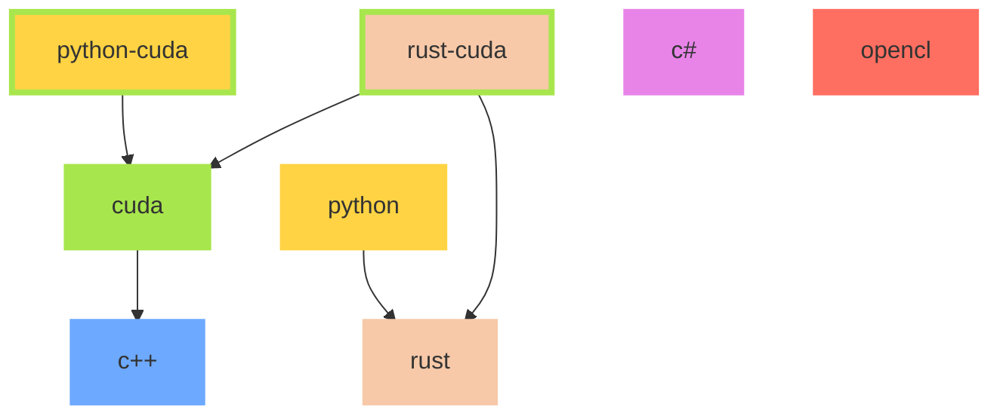

# pyxis

**Pyxis** is a multi-language library and toolkit for coordinate conversion and processing.  
It currently contains implementations in **Rust, Python, C, CUDA, C#, and OpenCL**.

The repository provides a central framework for coordinate-related computation, transformations, and experimentation.  
Details for each language, including API, tools, and target platforms, are maintained in their respective subfolders.

