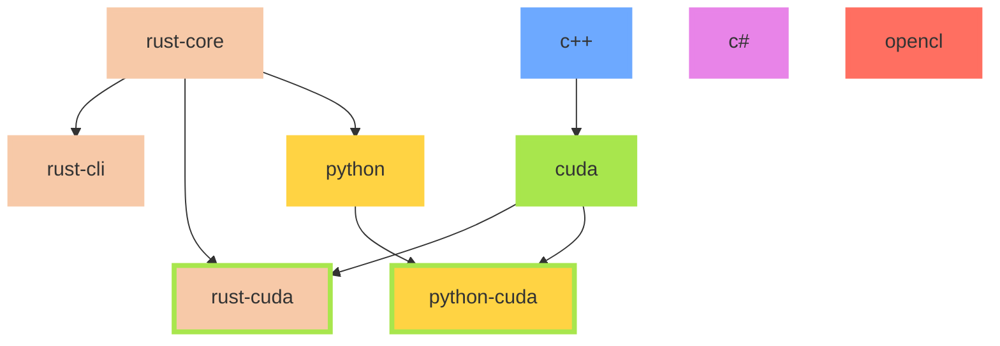

# feature list

## dependency graph

## dev features

| feature           | c++ | c#  | cuda | opencl | python | rust |
| ----------------- | --- | --- | ---- | ------ | ------ | ---- |
| format            | O   | O   | O    | X      | O      | O    |
| lint              | X   | O   | X    | X      | O      | O    |
| doc               | X   | X   | X    | X      | O      | O    |
| test              | X   | O   | X    | X      | O      | O    |
| bench             | X   | X   | X    | X      | O      | O    |
| ci                | O   | O   | O    | X      | O      | O    |
| update dependency | X   | O   | X    | X      | O      | O    |
| release           | O   | O   | O    | X      | O      | O    |
| publish           | X   | X   | X    | X      | O      | O    |

## features

| feature        | c++ | c#  | cuda | opencl | python | python(cuda) | rust | rust(cuda) |
| -------------- | --- | --- | ---- | ------ | ------ | ------------ | ---- | ---------- |
| bbox           | X   | O   | X    | X      | X      | X            | X    | X          |
| crypto         | O   | X   | O    | X      | O      | O            | O    | O          |
| datum_compensate | O   | X   | O    | X      | O      | O            | O    | O          |
| migrate        | X   | X   | X    | X      | O      | X            | O    | X          |
| Proj           | X   | X   | X    | X      | X      | X            | O    | X          |
| space          | X   | X   | X    | O      | O      | X            | O    | X          |
